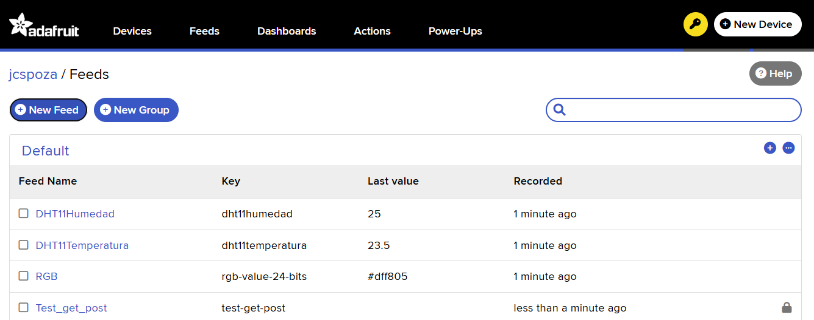
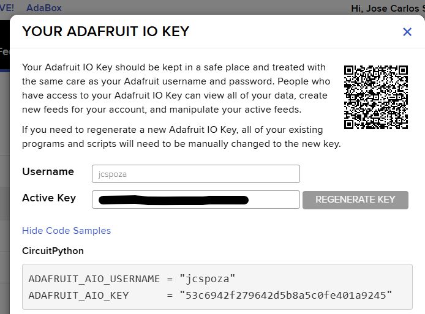
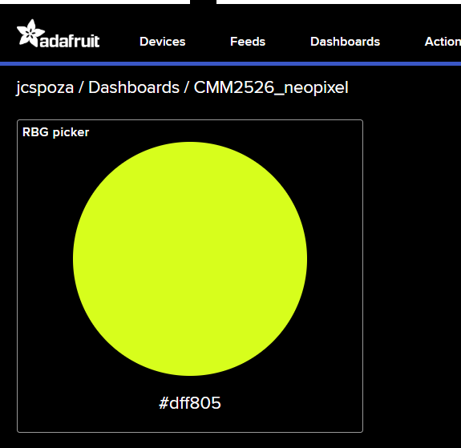
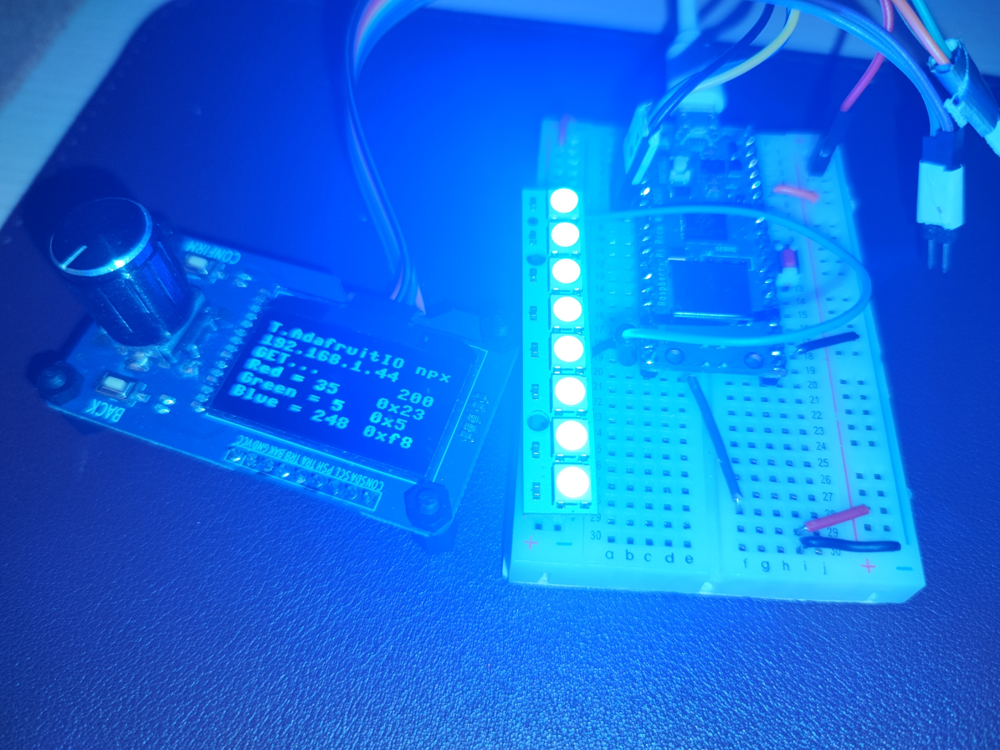

# 2526_CL8 uP: Uso del servicio Adafruit IO con HTTP - borrador avanzado

Indice evolutivo del las clases del taller + libros y webs de referencia:

[GitHub - Jcspoza/2526_PyR_Index: Curso Programación y Robotica 2025 2026 - CMM BML](https://github.com/Jcspoza/2526_PyR_Index)

## Indice - ( 2 a 3 dias de clase)

- Propósito

- Tutoriales y Programas que vamos a seguir

- Montaje HW

- Introducción Teórica al HTTP (simplificada) 

- Recordar : RTUTP_wifi_nastro_2_0.py, aplicación con HTTP

- Configuración de la cuenta Adafruit y 1ros pasos : feeds y dashboard

- Ejemplo de uso 1: obtener datos / instrucciones desde Internet --> Pico W/2W: leer color neopixel

- Ejemplo de uso 2: subir datos / status desde Pico W/2W --> Internet: enviar temperatura y humedad desde DHT11

- Preguntas sobre la Clase 8

## Propósito

( Sigue desde la clase 7 de 2025 - 2026)

Los montajes HW + SW robóticos muy pronto dentro de la linea de aprendizaje, empiezan a 'trocearse' y por necesidades de utilidad, uno de esos pedazos esta en la 'nube'. Este pedazo en l nube se puede programar desde cero ( como por ejemplo servidor web local) , pero lo normal es que se usen servicios en la nube pre-configurados, que con algo de configuracion sirven al proposito que queramos, como por ejemplo:

+ Ver valores de un sensor o una alarma

+ Encender o apagar una luz, motor,, etc.

+ Enviarnos un whatsapp o un mail , si un sensor pasa de cierto valor

+ etc.

En **numastro** lo que hacíamos era preguntar a un servicio en el nube y actuar en consecuencia a la informacion ( solo la mostrábamos en el ejemplo, pero hubiéramos podido tomar decisiones de programa con la informacion.

Mas poderoso es usar **servicios en al nube preconfigurados que permiten subir nuestra propia informacion o enviar comandos o valores** adaptados a nuestro montaje con la PICO W. Vamos a probar uno de estos servicios gratuitos el de [***Adafruit IO***](https://io.adafruit.com/).

## Tutoriales y Programas que vamos a seguir

### Tutoriales resumen

1. Servicio de Adafruit IO - darse de alta y configurar 
   
   1.A) El tutorial de SF 

[8.3 Temperature and Humidity Monitoring via @AdafruitIO &mdash; SunFounder Pico 2 W Starter Kit for Raspberry Pi Pico 2 W documentation](https://docs.sunfounder.com/projects/pico-2w-kit/en/latest/pyproject/iotproject/3-adafruitio.html)

**es confuso** porque mezcla HTTP y MQTT .: NO RECOMIENDO SEGUIRLO, <u>salvo su parte 2 de configuración del servicio de Adafruit IO</u>

1.B) Tutorial en castellano, ver el hasta que cuenta el codigo, que es para un neopixel pero lo realiza de forma diferente

[Raspberry Pi Pico W con Adafruit IO- control de neopixel codigo en micropython](https://youtu.be/Hee9fIwVGFs?si=nDDjqIZfNCCiUJM4)

1.C) y otro Tutorial ( que es mejor que el de SF)

[Upload Sensor Data to Adafruit IO with ESP32 and MicroPython | GPIO.CC Learning](https://gpiocc.github.io/learn/micropython/esp/2020/05/23/martin-ku-upload-sensor-data-to-adafruit-io-with-esp32-and-micropython.html)

o este otro tutorial

2. Explicación de HTTP Una buen y sencilla explicación del HTTP es 

[MicroPython: HTTP GET Requests with ESP32/ESP8266 | Random Nerd Tutorials](https://randomnerdtutorials.com/micropython-http-get-requests-esp32-esp8266/)

4. Repito 2 tutoriales de la Clase 7 que siguen siendo interesantes. 

Tutorial para 'Requests'

[Raspberry Pi Pico W: HTTP GET Requests (MicroPython) | Random Nerd Tutorials](https://randomnerdtutorials.com/raspberry-pi-pico-w-http-requests-micropython/)

Tutorial para tipo de datos JSON devuelto por la mayoría de los servidores

Ver tutorial [Python JSON Data: Una guía con ejemplos](https://www.datacamp.com/es/tutorial/json-data-python)

----

### Tabla resumen de programas

| Programa                                                           | Lenguaje | Objetivo de Aprendizaje                                           | Hw adicional                                                          |
| ------------------------------------------------------------------ | -------- | ----------------------------------------------------------------- | --------------------------------------------------------------------- |
| [secrets_vacio.py](secrets_vacio.py)                               | uPy      | Ver clase 7 de 2025-2026                                          | solo PICO W                                                           |
| [do_connect.py](do_connect.py)                                     | uPY      | Ver clase 7 2025-2026                                             | solo PICO W                                                           |
| [RTUTP_wifi_nastro_2_0.py](RTUTP_wifi_nastro_2_0.py)               | uPy      | Ver clase 7, uso simple de consulta de una API con GET en HTTP    | PICO W /2W + display SH1106                                           |
| [Rbhwt_sh1106_1_0.py](Rbhwt_sh1106_1_0.py)                         | uPY      | Test básico del display SH1106 + bus I2C + direccionamiento I2C   | PICO W /2W + display SH1106 GPIO 4 & 5                                |
| [Rbhwt_npx8_1_0.py](Rbhwt_npx8_1_0.py)                             | uPy      | Test básico de la tira neopixel x 8                               | PICO W /2W + tira x 8 neopixels en GPIO14                             |
| [RTUTP_wifiAFIO_get_2_0.py](RTUTP_wifiAFIO_get_2_0.py)             | uPy      | Programa tutorial - ejemplo de get de un feed en Adafruit IO      | PICO W /2W + display SH1106 GPIO 4 & 5                                |
| [R2526CL8_wifiAFIO_getnpx_2_0.py](R2526CL8_wifiAFIO_getnpx_2_0.py) | uPy      | Programa del ejemplo de uso 1 - Cambiar color de la tira neopixel | PICO W /2W + display SH1106 GPIO 4 & 5 + tira x 8 neopixels en GPIO14 |
|                                                                    |          |                                                                   |                                                                       |

### Recomendaciones de estudio despues de la clase

Leer / visualizar los tutoriales indicados

## Montaje HW

### Materiales

+ PICO W o 2W ( no vale la PICO sin wifi)

+ Display tipo OLED H1106 128 x 64 monocromo conexión  I2C ( no en el kit Sunfounder), se puede sustituir con relativa facilidad por un display SSD1306 mas usual, pero mas pequeño

+ Neopixel x8 conexión de datos de 1 hilo - [WS2812 RGB 8 LEDs Strip &mdash; SunFounder Pico 2 W Starter Kit for Raspberry Pi Pico 2 W documentation](https://docs.sunfounder.com/projects/pico-2w-kit/en/latest/component/component_ws2812.html)

+ Sensor de temperatura y Humedad DHT11 conexión de datos de  1 hilo - [DHT11 Humiture Sensor &mdash; SunFounder Pico 2 W Starter Kit for Raspberry Pi Pico 2 W documentation](https://docs.sunfounder.com/projects/pico-2w-kit/en/latest/component/component_humiture.html)

+ Resistencia para pull-up de linea de datos de DHT11 4,7kohm o 10Kohm [Resistor &mdash; SunFounder Pico 2 W Starter Kit for Raspberry Pi Pico 2 W documentation](https://docs.sunfounder.com/projects/pico-2w-kit/en/latest/component/component_resistor.html)

### Esquema

Este es el montaje completo, iremos usándolo progresivamente 

La resistencia de pull-up del DHT11 puede tener valores desde 4.7k ohm a 10 k Ohm


## Introducción Teórica al HTTP (simplificada)

Podemos seguir el tutorial 

[MicroPython: HTTP GET Requests with ESP32/ESP8266 | Random Nerd Tutorials](https://randomnerdtutorials.com/micropython-http-get-requests-esp32-esp8266/)

que aunque esta en ingles, es el que se adapta a un microcontrolador. O leer esta simple explicacion

### ¿Qué es HTTP realmente?

HTTP (*HyperText Transfer Protocol*) es un **protocolo de comunicación** que define cómo un cliente (normalmente un navegador) y un servidor intercambian información.

Su funcionamiento se basa en tres ideas clave:

#### 1. **Modelo cliente–servidor**

- El **cliente** envía una *petición* (request).

- El **servidor** responde con una *respuesta* (response).

#### 2. **Métodos**

Los más comunes:

- **GET** → pedir información.

- **POST** → enviar información.

- **PUT / DELETE** → modificar o borrar recursos.

#### 3. **Mensajes estructurados**

Una petición HTTP tiene:

- **Línea de petición** (GET /ruta)

- **Cabeceras** (headers)

- **Cuerpo** (body) — opcional

Una respuesta HTTP tiene:

- **Código de estado** (200, 404…)

- **Cabeceras**

- **Cuerpo** (HTML, JSON, texto, etc.)

### 🌐 ¿Cómo se adapta HTTP a un microcontrolador como la Pico W?

La Raspberry Pi Pico W **no ejecuta un sistema operativo**, pero sí puede:

- Conectarse a WiFi

- Abrir sockets TCP

- Implementar protocolos como HTTP

HTTP funciona **encima de TCP**, y la Pico W sí puede manejar TCP, así que el truco consiste en implementar una versión *ligera* del protocolo.

#### 🛠️Pico W como **servidor** HTTP

No lo voy a desarrollar, de momento

#### 📤 Pico W como **cliente** HTTP

La Pico W también puede **enviar** peticiones HTTP, por ejemplo para consumir una API REST:

```
import urequests

r = urequests.get("https://api.github.com")
print(r.text)
r.close()
```

Aquí la librería `urequests` simplifica todo el proceso:

- Abre el socket

- Envía la petición GET

- Recibe la respuesta

- Te entrega el cuerpo en texto o JSON

## Recordar : RTUTP_wifi_nastro_2_0.py, aplicación con HTTP

### Test del display SH1106

Ver como hacer el test en Clase 7 o con mas detalle en

### [2425CL10_DisplayGrafSH1106](https://github.com/Jcspoza/2425CL10_DisplayGrafSH1106)

Programa de Test del display SH1106 , que también prueba le bus I2C y errores de direccionamiento

[Rbhwt_sh1106_1_0.py](Rbhwt_sh1106_1_0.py)

### El programa Tutorial de consultar por API nastro 2_0

[RTUTP_wifi_nastro_2_0.py](RTUTP_wifi_nastro_2_0.py)

- El programa en versión 2.0 servirá para otros programas donde necesitemos consultar a un servidor por HTTP : GET , y con pocas modificaciones también para subir datos con POST

Los explicare paso a paso..... y además explicare de forma breve y simplificada:

- Display SH1106 (ver CL7)

- Peticiones API a un servidor por HTTP
  
  Ver tutorial para 'Requests' : [Raspberry Pi Pico W: HTTP GET Requests (MicroPython) | Random Nerd Tutorials](https://randomnerdtutorials.com/raspberry-pi-pico-w-http-requests-micropython/)

- Tipo de datos JSON devuelto por el servidor

Ver tutorial [Python JSON Data: Una guía con ejemplos](https://www.datacamp.com/es/tutorial/json-data-python)

## Configuración de la cuenta Adafruit y 1ros pasos : feeds y dashboard

--> Tutorial en castellano, ver el hasta que cuenta el codigo, que es para un neopixel pero lo realiza de forma diferente

[Raspberry Pi Pico W con Adafruit IO- control de neopixel codigo en micropython](https://youtu.be/Hee9fIwVGFs?si=nDDjqIZfNCCiUJM4)

1. Crear un usuario

2. Suscribir plan básico. El plan básico es Gratis: permite crear hasta 10 feeds y 5 Dashboards. Los feed son el elemento limitante, feed = elemento hw básico , por
   ejemplo, led de 1 color

3. Crear los “feeds” que necesites en función del proyecto, en nuestro proyecto serán 3 = 
   
   + 1 para el neopixel ( no usamos el direccionamiento de cada neopixel individual)
   
   + 2 para temperatura y humedad del sensor DHT 11

4. Componer un Dashboard con los “feeds”, eligiendo el tipo de control o visualizador on/of, slide, aguja, etc

5. Copiar clave, nombre de usuario y nombres de feeds, que necesitaremos en nuestro programa

## <u>Ejemplo de uso 1</u>: obtener datos / instrucciones desde Internet --> Pico W/2W : leer color neopixel

### Test del neopixel

Ver que es un neopixel en los tutoriales de Sunfounder 

[WS2812 RGB 8 LEDs Strip &mdash; SunFounder Pico 2 W Starter Kit for Raspberry Pi Pico 2 W documentation](https://docs.sunfounder.com/projects/pico-2w-kit/en/latest/component/component_ws2812.html)

Programa de test adaptado a neopixel de 8 pixeles 

[Rbhwt_npx8_1_0.py](Rbhwt_npx8_1_0.py) 

### Ejecutar un test GET genérico con Adafruit

1. Entro en mi cuenta de Adafruit IO [IO - Adafruit](https://io.adafruit.com/jcspoza/overview)

2. Creo un feed para el neopixel y lo nombro como 'rgb-value-24-bits' ( por ejemplo)

3. 

4. Miro y copio mi clave secreta

5. 

6. Configuro un Dashboard para ese feed

7. 

8. Con la web abierta en el dashboard ejecutamos el test de GET paras ese feed

9. Estudiar / Explicar el programa [RTUTP_wifiAFIO_get_2_0.py](RTUTP_wifiAFIO_get_2_0.py)

Veremos algo asi en la consola

```
Program: Test GET en adafruit: feed 'rgb-value-24-bits' - Version: 1.0
Key Library: SH1106  @robert-hh + requests
CONNECTED-STAT_Connected
Valor del color en hexadecimal #dff805
```

Por  ultimo, probamos a cambiar valores en la web de Adafruit y ver como los lee el programa

### Ejecutar el ejemplo: 'R2526CL8_wifiAFIO_getnpx_2_0.py' y ver como cambia el color

[R2526CL8_wifiAFIO_getnpx_2_0.py](R2526CL8_wifiAFIO_getnpx_2_0.py)

Este programa añade sobre get 2_0 :

* El objeto neopixel

* Convertir el valor leído de 24 bits / 6 cifras hexadecimales en 3 porciones de 8 bits --> se explicara en clase

* Asignar ese color al todos los pixeles del la tira ( no usa el direccionamiento de cada pixel) 

No se ejecuta mas que 1 vez. En un caso real se ejecutaría en bucle cada minuto por ejemplo



---- FIN ACTUALIZACION ---

## Ejemplo de uso 2: subir datos / status desde Pico W/2W --> Internet : enviar temperatura y humedad desde DHT11

---

## Preguntas sobre la Clase 8

Sección para que los alumnos pregunten sus dudas durante la clase

---

### TO DO :

+ Ejemplo 3 sumando ejemplos 1 y 2 : control de color de neopixel y mostrar valores de temperatura y humedad
